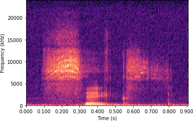

# Audio Signal Learning

This repository contains sandbox experiments in audio processing with deep learning. 

Right now, it implements the following technique:

* Classifying recordings of spoken digits with a convolutional neural network on spectrograms
* Spectrogram inversion via training a 1D transposed convolution layer

## Background

By representing audio signals with spectrograms, such as the spoken number six visualized below, they can be processed in matrix format not unlike the digital pixel images that convolutional neural networks were originally designed for.

  

## Credit

The data used here is based on the [AudioMNIST dataset](https://arxiv.org/abs/1807.03418) of spoken digits by Sören Becker, as found here: \
[https://github.com/soerenab/AudioMNIST](https://github.com/soerenab/AudioMNIST)

Some of the techniques used here are inspired by the work of Peter Bermant and his colleagues at the Earth Species Project and their repository on source separation: \
[https://github.com/earthspecies/cocktail-party-problem](https://github.com/earthspecies/cocktail-party-problem)
And the torch-stft implementation of pseeth at: \
[https://github.com/pseeth/torch-stft](https://github.com/pseeth/torch-stft)
